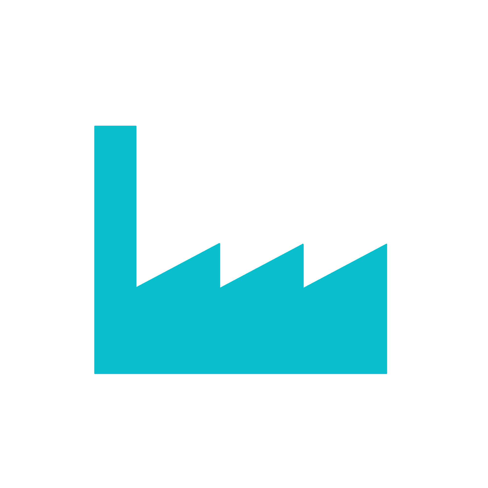

# Manuel Ostermaier

### Manager Software & Electrical Development

Software Developer & Team Manager | Spezialisiert auf Team Leadership & industrielle Softwareentwicklung | Auf der Suche nach spannenden technischen Challenges, starkem Team-Spirit und Raum für Innovation

 

## 💼 Erfahrung

<table>
<tr>
<td width="120"></td>
<td>

**Manager Software & Electrical Development**
*montratec GmbH by Columbus McKinnon* · Vollzeit 
📅 Juli 2024 – Heute · 2 Jahre 3 Monate &nbsp;|&nbsp; 📍 Dauchingen, Hybrid

Projekt- & Produktverantwortung: 
Technische Leitung von neuen  Entwicklungsprojekten von der Konzeption bis zur Serienreife sowie die  Betreuung und Weiterentwicklung des bestehenden Produktportfolios über  den Lebenszyklus.

Softwareentwicklung: 
Konzeption und Programmierung von Embedded-Systemen sowie Hochsprachenanwendungen.

Hardwareentwicklung: 
Leitung der Hardwareentwicklung mit Fokus auf PCB-Design, Layout und Validierung.

Systemintegration: Integration und Validierung externer Sensorik und Aktorik.

</td>
</tr>
</table>

<b>montratec GmbH</b> · Vollzeit · 7 Jahre 3 Monate · Hybrid (weitere Stationen anzeigen)

 

<table>
<tr>
<td width="120"></td>
<td>

**Director of Development Electrical Engineering** 
📅 Dez. 2020 – Juni 2024 · 3 Jahre 7 Monate &nbsp;|&nbsp; 📍 Dauchingen

Projekt- & Produktverantwortung: 
Technische Leitung von neuen  Entwicklungsprojekten von der Konzeption bis zur Serienreife sowie die  Betreuung und Weiterentwicklung des bestehenden Produktportfolios über  den Lebenszyklus.

Softwareentwicklung: 
Konzeption und Programmierung von Embedded-Systemen sowie Hochsprachenanwendungen.

Hardwareentwicklung: 
Leitung der Hardwareentwicklung mit Fokus auf PCB-Design, Layout und Validierung.

Systemintegration: Integration und Validierung externer Sensorik und Aktorik.

</td>
</tr>
<tr>
<td width="120"></td>
<td>

**Electrical Engineering Team Visualization** 
📅 Apr. 2017 – Dez. 2020 · 3 Jahre 9 Monate &nbsp;|&nbsp; 📍 Niedereschach

Weiterführung der bisherigen Position nach Übergang eines Teilbetriebs von Schmid Technology Systems GmbH zu montratec GmbH.

</td>
</tr>
</table>

 

<table>
<tr>
<td width="120"></td>
<td>

**Electrical Engineering Team Visualization**
*Schmid Technology Systems* · Vollzeit 
📅 Okt. 2009 – Apr. 2017 · 7 Jahre 7 Monate &nbsp;|&nbsp; 📍 Niedereschach, Vor Ort

Anlagenvisualisierung im Bereich Anlagenbau für die Photovoltaik-Industrie. Teamleitung ab Januar 2016.

</td>
</tr>
<tr>
<td width="120"></td>
<td>

**Softwareentwickler**
*Marquardt GmbH* · Vollzeit 
📅 Jan. 2009 – Aug. 2009 · 8 Monate &nbsp;|&nbsp; 📍 Rietheim, Vor Ort

Softwareentwicklung im Bereich Fertigungsnahe IT-Systeme

</td>
</tr>
<tr>
<td width="120"></td>
<td>

**Softwareentwickler**
*C/SPlus Personalservices GmbH* · Vollzeit 
📅 Juni 2008 – Dezember 2008 · 7 Monate &nbsp;|&nbsp; 📍 Rietheim, Vor Ort

Als externer Mitarbeiter bei der Firma Marquardt GmbH im Bereich Fertigungsnahe IT-Systeme tätig.
</td>
</tr>
</table>

 

## 🎓 Ausbildung

<table>
<tr>
<td width="120"></td>
<td>

**Fachhochschule Albstadt-Sigmaringen**
Kommunikation und Softwaretechnik 
📅 Oktober 2003 - August 2008 &nbsp;|&nbsp; 📍 Albstadt

Studienschwerpunkt Kommunikationstechnik

Gesamtnote: 2,2

Thema Diplomarbeit: Analyse und Weiterentwicklung eines Variantenhaltungskonzeptes mit Präprozessorschaltern  
Note Diplomarbeit: 1,5
</td>
</tr>
</table>

Weitere schulische Stationen anzeigen

 

- **Berufskolleg II**, Balingen · 2001 – 2002
- **Berufskolleg I**, Balingen · 2000 – 2001
- **Realschule Schömberg** · 1994 – 2000

 

## 🛠️ Tech-Stack & Skills

<table>
<tr>
<td width="120"></td>
<td>

**Programmiersprachen**
- C
- C++
- C#
- JavaScript

</td>
</tr>
</table>

<table>
<tr>
<td width="120"></td>
<td>

**Frameworks & UI**
- .NET
- WPF
- CSS3
- LiveCharts

</td>
</tr>
</table>

<table>
<tr>
<td width="120"></td>
<td>

**Datenbanken**
- MS SQL Server
- MySQL

</td>
</tr>
</table>

<table>
<tr>
<td width="120"></td>
<td>

**Development Tools & IDEs**
- Visual Studio
- Visual Studio Code
- Eclipse
- MPLAB 

</td>
</tr>
</table>

<table>
<tr>
<td width="120"></td>
<td>

**Kommunikation & Protokolle**
- TCP/IP
- CAN-Bus
- OPC UA
- OPC DA
- MQTT

</td>
</tr>
</table>

<table>
<tr>
<td width="120"></td>
<td>

**Betriebssysteme**
- Windows
- Linux

</td>
</tr>
</table>

<table>
<tr>
<td width="120"></td>
<td>

**Projektmanagement & Collaboration**
- Azure DevOps
- Asana
- Agile / Scrum
- Team Leadership & Mentoring
- Anforderungsmanagement & Spezifikation (Lastenheft, Pflichtenheft)
- Performance Level Management
- Technical Documentation
- Product Lifecycle Management

</td>
</tr>
</table>

 

## 🏔️ Hobbys

 

## 📫 Kontakt

Auf allen Plattformen zu finden:

