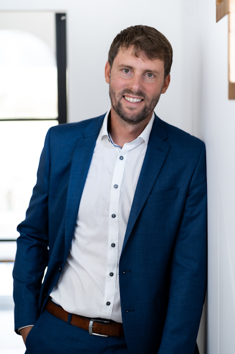
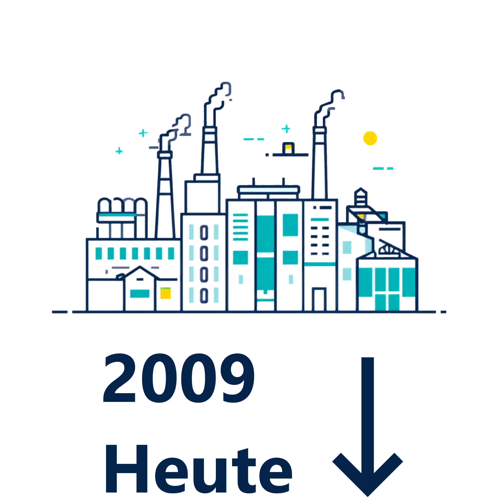
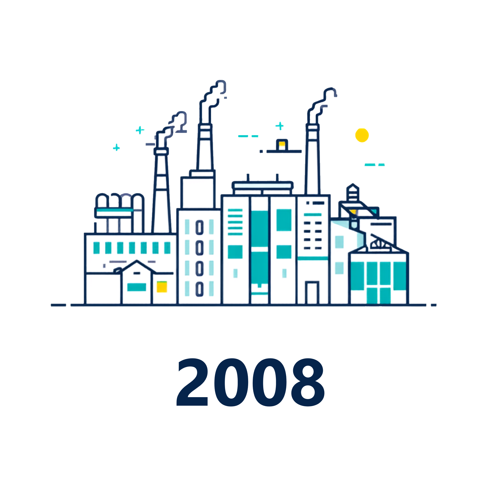
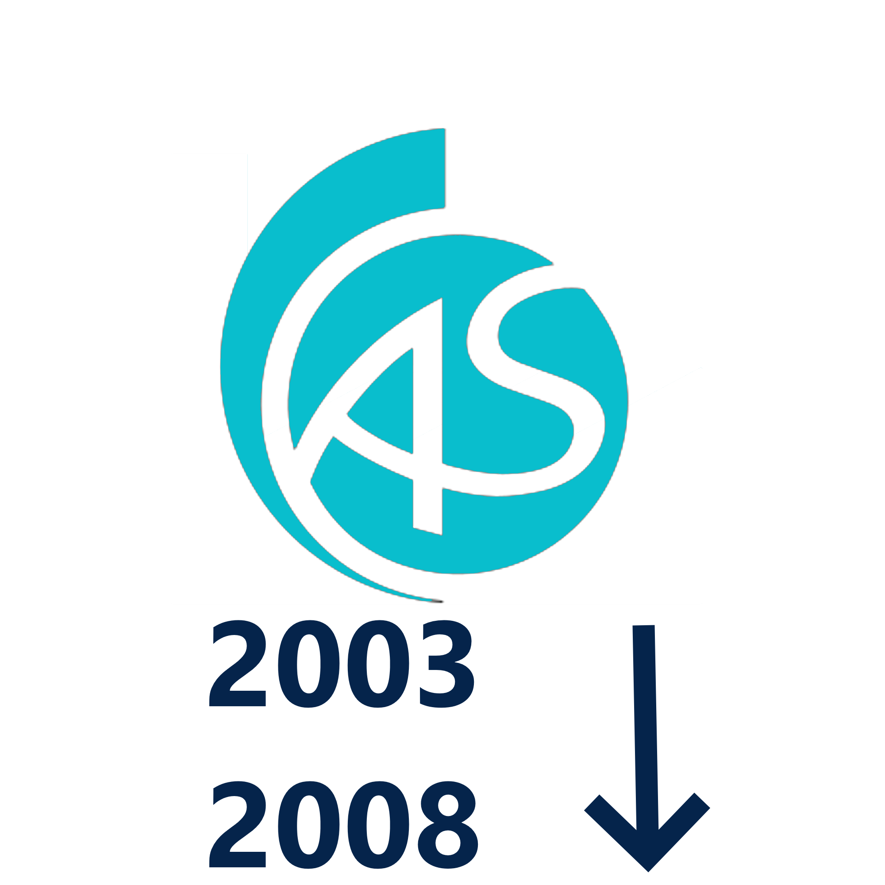
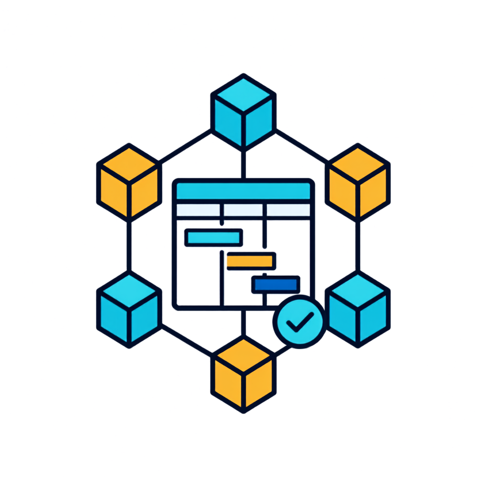
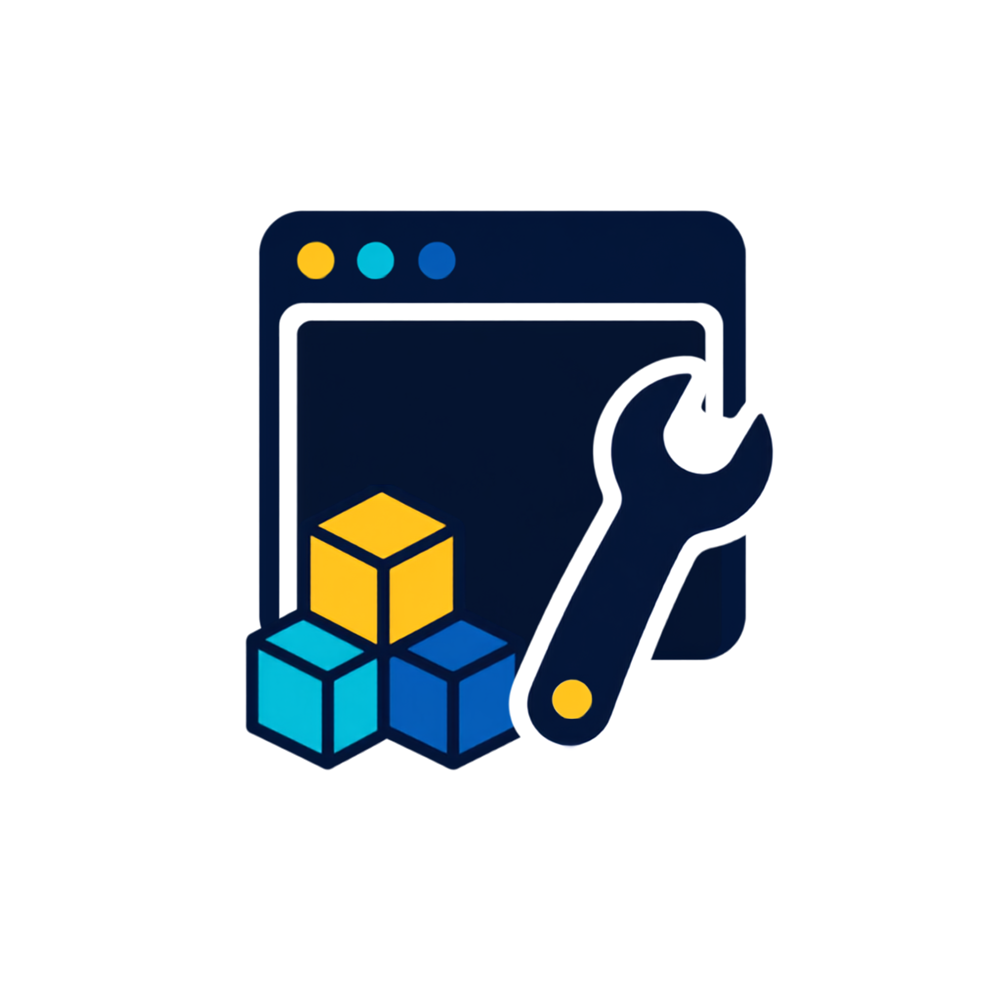
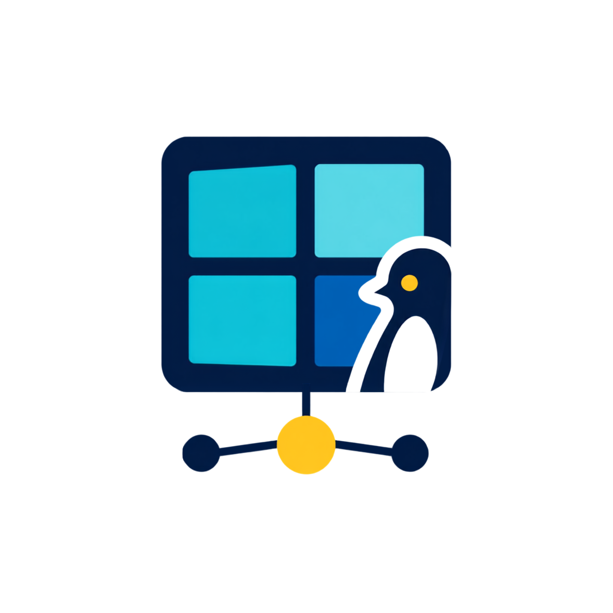

# Manuel Ostermaier

### Manager Software & Electrical Development

Software Developer & Team Manager | Spezialisiert auf Team Leadership & industrielle Softwareentwicklung | Auf der Suche nach spannenden technischen Challenges, starkem Team-Spirit und Raum für Innovation

 

## 💼 Erfahrung

<table>
<tr>
<td width="160"></td>
<td>

**Manager Software & Electrical Development**
*montratec GmbH by Columbus McKinnon* · Vollzeit 
📅 Juli 2024 – Heute · 2 Jahre 3 Monate &nbsp;|&nbsp; 📍 Dauchingen, Hybrid

Projekt- & Produktverantwortung: 
Technische Leitung von neuen  Entwicklungsprojekten von der Konzeption bis zur Serienreife sowie die  Betreuung und Weiterentwicklung des bestehenden Produktportfolios über  den Lebenszyklus.

Softwareentwicklung: 
Konzeption und Programmierung von Embedded-Systemen sowie Hochsprachenanwendungen.

Hardwareentwicklung: 
Leitung der Hardwareentwicklung mit Fokus auf PCB-Design, Layout und Validierung.

Systemintegration: Integration und Validierung externer Sensorik und Aktorik.

<b>📂 Projekte</b>

 

**🛠️ Neuentwicklung einer Shuttlesteuerung**
*Intralogistik*  
📅 Oktober 2023 – Juni 2026 · 2 Jahre 8 Monate &nbsp;|&nbsp; 📍 Niedereschach, vor Ort

* **Beschreibung:** Verantwortung für die komplette Neuentwicklung der Shuttlesteuerung für das montratec Shuttle Portfolio in Zusammenarbeit mit einem externen Entwicklungspartner.
* **Details:** Das Projekt umfasste die Steigerung der Systemleistung auf 100W sowie die Vorbereitung auf das Performancelevel C nach ASIL-Standard. Im Zuge der Modernisierung wurden sämtliche Komponenten auf den aktuellen Stand der Technik gebracht und zukunftssicher ausgelegt; die Steuerung basiert auf einem modernen STM32-Prozessor unter Verwendung aktueller Firmware-Bibliotheken. Zur proaktiven Fehlererkennung wurden intelligente Predictive-Maintenance-Funktionen integriert, welche auf Vibrationsmessung, Strommessung und Temperaturüberwachung beruhen. Der gesamte Entwicklungszyklus basierte auf kontinuierlichen Anforderungsanalysen, der Erstellung von Lasten- und Pflichtenheften, fundierter Technologie-Selektion sowie der Definition von Sicherheitsfunktionen nach geltenden Normen. Durch mehrstufige Iterationen in der Prototypenverifikation und Validierung wurde die Serienreife erlangt. Vor dem finalen Start der Serienproduktion erfolgte der erfolgreiche Einsatz und die Validierung erster Prototypen bei strategischen Kunden.

<b>weitere Stationen</b>

 
  
**Director of Development Electrical Engineering**
*montratec GmbH* · Vollzeit 
📅 Dezember 2020 – Juni 2024 · 3 Jahre 7 Monate &nbsp;|&nbsp; 📍 Dauchingen

Projekt- & Produktverantwortung: 
Technische Leitung von neuen  Entwicklungsprojekten von der Konzeption bis zur Serienreife sowie die  Betreuung und Weiterentwicklung des bestehenden Produktportfolios über  den Lebenszyklus.

Softwareentwicklung: 
Konzeption und Programmierung von Embedded-Systemen sowie Hochsprachenanwendungen.

Hardwareentwicklung: 
Leitung der Hardwareentwicklung mit Fokus auf PCB-Design, Layout und Validierung.

Systemintegration: Integration und Validierung externer Sensorik und Aktorik.

<b>📂 Projekte</b>

 

**🛠️ Technische Leitung der Neuentwicklung eines Kommunikationsmoduls mit IO-Link**
*Intralogistik*  
📅 Mai 2021 – Dezember 2024 · 3 Jahre 8 Monate &nbsp;|&nbsp; 📍 Niedereschach, vor Ort und europaweit (Kundeneinsätze)  

* **Beschreibung:** Projektplanung und technische Verantwortung für die Neuentwicklung eines Kommunikationsmoduls zwischen System (Schiene) und Shuttles.
* **Details:** Die Hardware zeichnet sich durch eine sehr kompakte Bauform und hohe Verfügbarkeit aus und ist für den industriellen Einsatz ausgelegt. Die Programmierung erfolgte als Bare-Metal-Anwendung in C/C++ unter Einbindung eines externen IO-Link-Stacks, wobei besonderer Fokus auf der Optimierung des Datendurchsatzes lag. Das Modul ist IO-Link-zertifiziert und modular erweiterbar.
 

**🛠️ Reengineering der Shuttlesteuerung**
*Intralogistik*  
📅 März 2018– Dezember 2022 · 4 Jahre 10 Monate &nbsp;|&nbsp; 📍 Niedereschach, vor Ort

* **Beschreibung:** Fachliche Koordination des Reengineerings der Leiterplatte und der Software der Shuttlesteuerung.
* **Details Hardware-Reengineering:** Fachliche Koordination des Redesigns von Leiterplatten zur Kompensation abgekündigter Bauteile. Erfolgreiche Integration modernster Erkenntnisse zur Optimierung der Motoransteuerung.
* **Details Software-Reengineering:** Steuerung der Firmware-Anpassungen sowie Durchführung gezielter Bugfixes zur nachhaltigen Steigerung der Systemstabilität und Softwarequalität.
* **Details Projektkoordination:** Zentrale Schnittstellenfunktion und fachliche Führung der Bereiche Hardware-Entwicklung, Software-Team und Qualitätssicherung zur Sicherstellung der Projektziele.
 

**Electrical Engineering Team Visualization**
*montratec GmbH* · Vollzeit 
📅 April 2017 – Dezember 2020 · 3 Jahre 9 Monate &nbsp;|&nbsp; 📍 Niedereschach

Weiterführung der bisherigen Position nach Übergang eines Teilbetriebs von Schmid Technology Systems GmbH zu montratec GmbH.

<b>📂 Projekte</b>

 

**🛠️ Neuentwicklung des proprietären Materialflusscontrollers**
*Intralogistik*  
📅 April 2017– Dezember 2020 · 2 Jahre 8 Monate &nbsp;|&nbsp; 📍 Niedereschach, vor Ort und europaweit (Kundeneinsätze)  

* **Beschreibung:** Fachliche Koordination der Backend-Neuentwicklung des proprietären Materialflusscontrollers in Zusammenarbeit mit einem externen Entwicklungsbüro sowie eigene Entwicklungstätigkeit.
Installation, kundenspezifische Anpassung, Inbetriebnahme und Optimierung des Materialflusscontrollers mit Kunden.
* **Details:** Datenerfassung von Anlageninformationen via UDP/OPC, Datenaufbereitung und -persistierung in der DB sowie ereignisgesteuerte Anstoßung nachgelagerter Automatisierungsfunktionen. Ziel war eine zukunftssichere, aktuelle Technologiebasis (.NET, Windows Service). Zusätzlich wurden das Handling durch ein eigenes VS-Code-AddOn zur Funktionserstellung vereinfacht sowie eine automatische Shuttle-Routenplanung auf Basis des Dijkstra-Algorithmus realisiert.
 

**Electrical Engineering Team Visualization**
*Schmid Technology Systems* · Vollzeit 
📅 Oktober 2009 – Apr. 2017 · 7 Jahre 7 Monate &nbsp;|&nbsp; 📍 Niedereschach, Vor Ort

Anlagenvisualisierung im Bereich Anlagenbau für die Photovoltaik-Industrie. Teamleitung ab Januar 2016.

<b>📂 Projekte</b>

 

**🛠️ Technische Produktübernahme: Montratec Shuttlesystem**
*Intralogistik*  
📅 Januar 2014 – April 2017 · 3 Jahre 4 Monate &nbsp;|&nbsp; 📍 Niedereschach, vor Ort und weltweit (Kundeneinsätze)  

* **Beschreibung:** Übernahme der technischen und fachlichen Verantwortung für die Software nach Standortwechsel des Produkts. Weiterentwicklung und Bugfixing des bestehenden Systems. Integration des Produkts in das bestehende Portfolio.
* **Details:** Erfolgreiche Durchführung des Technologietransfers inklusive technischem Know-how-Transfer, Aufbau einer zeitgemäßen Entwicklungsumgebung sowie Implementierung der zugehörigen Build-Prozesse am neuen Standort.
 

**🛠️ Webbasiertes Anlagenvisualisierungs- und Steuerungssystem**
*Photovoltaik-Fertigungsanlagenbau*  
📅 Oktober 2009 – Dezember 2015 · 7 Jahre 7 Monate &nbsp;|&nbsp; 📍 Niedereschach, vor Ort und weltweit (Kundeneinsätze)  

* **Beschreibung:** Weiterentwicklung kundenspezifische Anpassung einer proprietäre Unternehmenssoftware zur dynamischen Visualisierung und Steuerung der Anlage. 
* **Details:** Konzeption und Umsetzung zentraler Funktionsbereiche wie Live-Datenanzeige, Historienauswertung, Benutzerverwaltung, Maintenance-Funktionen sowie Fehlermeldungsmanagement. Realisierung als webbasierte Anwendung auf Basis von ASP und JavaScript (Frontend/Logik) sowie MS SQL (Datenbank), gehostet auf IIS.

</td>
</tr>
<tr>
<td width="160"></td>
<td>

**Softwareentwickler**
*Marquardt GmbH* · Vollzeit 
📅 Jan. 2009 – Aug. 2009 · 8 Monate &nbsp;|&nbsp; 📍 Rietheim, Vor Ort

Softwareentwicklung im Bereich Fertigungsnahe IT-Systeme

</td>
</tr>
<tr>
<td width="160"></td>
<td>

**Softwareentwickler**
*C/SPlus Personalservices GmbH* · Vollzeit 
📅 Juni 2008 – Dezember 2008 · 7 Monate &nbsp;|&nbsp; 📍 Rietheim, Vor Ort

Als externer Mitarbeiter bei der Firma Marquardt GmbH im Bereich Fertigungsnahe IT-Systeme tätig.
</td>
</tr>
</table>

## 🎓 Ausbildung

<table>
<tr>
<td width="160"></td>
<td>

**Fachhochschule Albstadt-Sigmaringen**
Kommunikation und Softwaretechnik 
📅 Oktober 2003 - August 2008 &nbsp;|&nbsp; 📍 Albstadt

Studienschwerpunkt Kommunikationstechnik

Gesamtnote: 2,2

Thema Diplomarbeit: Analyse und Weiterentwicklung eines Variantenhaltungskonzeptes mit Präprozessorschaltern  
Note Diplomarbeit: 1,5
</td>
</tr>
</table>

Weitere schulische Stationen anzeigen

 

- **Berufskolleg II**, Balingen · 2001 – 2002
- **Berufskolleg I**, Balingen · 2000 – 2001
- **Realschule Schömberg** · 1994 – 2000

## 🛠️  Technisches Profil & Qualifikationen

<table>
<tr>
<td width="160"></td>
<td>

**Projektmanagement & Kooperation**
- Azure DevOps
- Asana
- Agile / Scrum
- Teamführung
- Anforderungsmanagement & Spezifikation (Lastenheft, Pflichtenheft)
- Performance Level Management
- Technische Dokumentation
- Produktlebenszyklus-Management

</td>
</tr>
<tr>
<td width="160"></td>
<td>

**Programmiersprachen**
- C
- C++
- C#
- JavaScript

</td>
</tr>
<tr>
<td width="160"></td>
<td>

**Frameworks**
- .NET
- WPF
- CSS3
- LiveCharts

</td>
</tr>
<tr>
<td width="160"></td>
<td>

**Datenbanken**
- MS SQL Server
- MySQL

</td>
</tr>
<tr>
<td width="160"></td>
<td>

**Entwicklungsumgebungen**
- Visual Studio
- Visual Studio Code
- Eclipse
- MPLAB

</td>
</tr>
<tr>
<td width="160"></td>
<td>

**Kommunikation & Protokolle**
- UDP & TCP/IP
- CAN-Bus
- OPC UA
- OPC DA
- MQTT

</td>
</tr>
<tr>
<td width="160"></td>
<td>

**Betriebssysteme**
- Windows
- Linux

</td>
</tr>
</table>

## 🏔️ Hobbys

## 🤝 Ehrenamtliche Tätigkeiten

- Jugendtrainer Bambinis TG Schömberg Handball
- Vorstandschaft · Schiedsrichterwart TG Schömberg Handball

## 📫 Kontakt

Auf allen Plattformen zu finden:

